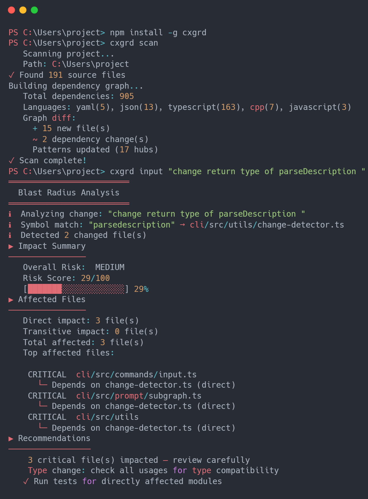

<table align="center">
  <tr>
    <td></td>
    <td><h1> CXGRD </h1></td>
  </tr>
</table>

<p align="center">
  
  
</p>

<h1 align="center">Architectural Guardrail for AI-native development</h1>

<p align="center">CXGRD maps blast radius across your codebase, so AI tools know what they will break - before they write a line</p>

<div align="center">
  
</div>

**CXGRD** scans your project, builds a dependency graph, and gives AI assistants the architectural context they need to make safer changes.

- **Tell you exactly what will break** before a change lands.
- **Enrich AI prompts** with project structure, dependencies, and blast-radius analysis.
- **Validate architecture** with circular dependency checks, orphan detection, and compiler-backed validation.
- **Enforce merge policies** in GitHub Actions to protect your team from risky changes.

---

### Typical workflow

```bash
# 1. Install
npm install -g cxgrd

# 2. Authenticate
cxgrd auth login
# Required for Pro, Team, and Enterprise plans

# 3. Scan your project
cxgrd scan

# 4. Check blast radius before a change
cxgrd input "extract UserService into a separate module"

# 5. Generate an enriched prompt for your AI
cxgrd prompt "extract UserService into a separate module"

# 6. Validate the result
cxgrd check
```

### See it in action

[![CXGRD Demo]](https://github.com/user-attachments/assets/7ea3ff22-d187-4166-9a84-1395bf7a625a)

---

### Core commands

- `cxgrd scan` → writes .cg/ from scratch or diffs it
- `cxgrd input` → reads graph + architecture + history, writes to history.json
- `cxgrd prompt` → reads everything, sends a subgraph to your LLM, and returns an enriched prompt
- `cxgrd check` → reads graph + compiler output, writes result to history.json
- `cxgrd auth login` → log in for Pro, Team, and Enterprise users
- `cxgrd doctor` → verifies toolchain readiness before strict checks
- `cxgrd watch` → monitors dependency changes in real time
- `cxgrd init-hooks` → installs pre-commit checks automatically

---

For more information, visit the [official website](https://www.cxgrd.com) or read the docs [here](https://docs.cxgrd.com).

[Report Bug](https://github.com/cxgrd/cli/issues/new/choose) · [Request Feature](https://github.com/cxgrd/cli/issues/new/choose)
